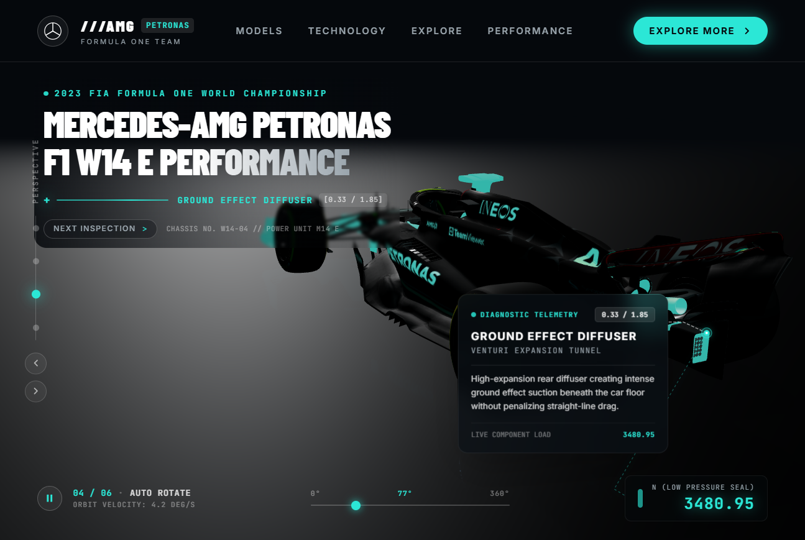

# 3D-Car-interactive - Mercedes-AMG Petronas F1 W14 3D Showcase

A 3D car modeled website with interactive animations, continuous scroll-driven exploration, and real-time telemetry effects. Best for automotive brands searching for high-end 3D web experiences.



---

## Features

- **True Scroll-Driven Experience**: Continuous physical scroll (`scrollProgress` 0.0 → 1.0) dynamically drives camera position, target look-at, vehicle rotation, callout visibility, and live telemetry across 6 distinct exploration stages.
- **Dominant Viewport-Filling Hero**: The Mercedes W14 is scaled to ~85% of desktop viewport width in an aggressive, low-stance front 3/4 beauty view with compact upper-left editorial typography.
- **Cinematic Studio Environment**: Rich charcoal/graphite radial glow (`rgba(40,85,92,0.45)` spotlight), multi-point studio lighting (key light, fill light, top light, elevated teal rim light), and matte reflective PBR floor with zero WebGL crashes.
- **Dynamic 3D-to-2D Part Callouts**: Data-driven callouts projected in real-time from 3D local coordinates to screen space with responsive bounds clamping to prevent any card overlap with the hero text.
- **Hardware-Accelerated Leader Lines**: SVG lines connecting 3D anchor points to floating glassmorphism diagnostic cards, with pulsing Petronas teal anchor dots and diagonal lines connecting to bottom telemetry stats.
- **Calibrated Emissive Rim-Light Highlight**: Active car components glow with a subtle, non-washing luminous pulse (`0.22` intensity) that preserves original carbon weave and sponsor decals.
- **Bidirectional Scrubbing & Viewpoint Rail**: Interactive scrubber track (0%–100%) and left viewpoint rail for direct one-click navigation to key aerodynamic features, plus optional auto-cruise mode.

---

## Tech Stack

- **React 18**
- **Vite 5**
- **React Three Fiber (`@react-three/fiber`)** + **Drei (`@react-three/drei`)**
- **Three.js (r160+)**
- **Tailwind CSS** + Custom Design Tokens
- **Framer Motion** for UI and callout transitions
- **Zustand** for global scene and interaction state

---

## Project Structure

```
├── public/
│   └── models/
│       ├── mercedes_w14.glb    # High-detail 2023 W14 GLB model
│       └── f1-car.glb          # Standard alias
├── src/
│   ├── components/
│   │   ├── Navbar.tsx          # Mercedes 3-pointed star, AMG wordmark, CTA
│   │   ├── HeroText.tsx        # 2-line headline, animated scan line with '+' icon
│   │   ├── ViewpointRail.tsx   # Left vertical rail with 4 discrete viewpoints
│   │   ├── CalloutLabel.tsx    # Framer Motion diagnostic telemetry cards
│   │   ├── LeaderLineOverlay.tsx # SVG leader lines and pulsing anchor dots
│   │   ├── ControlBar.tsx      # Play/pause, 0-360° scrubber, live stat readout
│   │   └── CanvasLoader.tsx    # F1 telemetry loader for Suspense
│   ├── scene/
│   │   ├── CarViewerCanvas.tsx # R3F Canvas root with tone mapping & shadows
│   │   ├── CarModel.tsx        # GLB loader, auto-scaling, emissive highlighting
│   │   ├── AutoRotateRig.tsx   # OrbitControls, lerp viewpoints, 3D anchor projection
│   │   └── StudioEnvironment.tsx # Studio floor reflection, softbox strips, fog
│   ├── data/
│   │   ├── callouts.ts         # Callout definitions (anchors, mesh names, specs)
│   │   └── viewpoints.ts       # 4 camera presets (positions, targets, FOV)
│   ├── store/
│   │   └── useCalloutStore.ts  # Zustand store
│   ├── App.tsx                 # Root layout & overlay assembly
│   ├── main.tsx                # React DOM entrypoint
│   └── index.css               # Tailwind CSS & design variables
```

---

## How to Customize

### 1. How to Swap in a Different 3D Car Model

1. Place your new `.glb` file into `public/models/` (for example, `public/models/my-new-car.glb` or overwrite `f1-car.glb`).
2. In `src/scene/CarModel.tsx`, update the path passed to `useGLTF`:
   ```tsx
   const { scene } = useGLTF('/models/my-new-car.glb');
   ```
3. `CarModel.tsx` automatically computes the bounding box, centers the car at `[0, 0, 0]`, scales it to a standard target length (`4.6 units`), and rests the bottom wheels on the floor (`y = 0`).

### 2. How to Edit Callouts and Re-Target 3D Anchors

Open `src/data/callouts.ts`. Each callout has:

```ts
{
  id: "wing",
  label: "AERODYNAMIC FRONT WING",
  sublabel: "CASCADE FLAP COMPLEX",
  stat: "0.33 / 1.85",
  telemetryValue: "1842.60",
  telemetryUnit: "N (VORTEX DOWNFORCE)",
  description: "Four-tier carbon wing elements channeling outwash...",
  anchor3D: [0.0, 0.22, 2.1], // [X, Y, Z] in car local coordinates
  meshNames: ["NOSE", "FWING", "Object_410"], // Matches any mesh or parent node name
  cameraViewpoint: 0, // 0: Front 3/4, 1: Side, 2: Rear 3/4, 3: Cockpit
}
```

- **`anchor3D`**: `[X, Y, Z]` where `+Z` is toward the front nose, `-Z` is toward the rear diffuser, `+Y` is up from the floor, and `X` is lateral.
- **`meshNames`**: Substrings to match against node or mesh names in your model for the teal rim-light highlight.

### 3. How to Edit Camera Viewpoints

Open `src/data/viewpoints.ts`:

```ts
{
  id: 0,
  name: "FRONT 3/4",
  code: "CAM-01 / FRONT-QTR",
  position: [4.1, 1.4, 3.8], // Camera 3D position
  target: [-0.3, 0.25, 0.2],   // Look-at center
  fov: 38,
}
```

---

## Getting Started

```bash
# 1. Install dependencies
npm install

# 2. Run the development server
npm run dev

# 3. Build production bundle
npm run build
```
